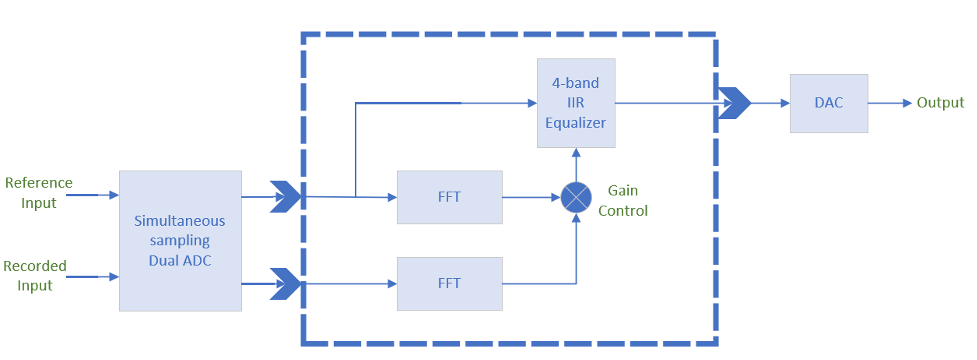

# Acoustic Calibrator
>A real-time embedded audio system that filters a raw audio signal to counteract the unique acoustic frequency characteristics of a room. Developed by John Matson and Alexander Mueller in fall 2020 for BCIT's ELEX 7820, taught by David Romalo.

## Usage
The callibrator is designed for the TMS320F28027 Piccolo Launchpad with integrated dual-sample 12-bit ADC and the external TLV5616CP 12-bit DAC. To begin calibration, perform the following steps:
1. Scale & shift a line-level mono audio source so that it is centered around 1.67 V with a maximum peak-to-peak voltage of 3.3 V.
2. Connect this scaled & shifted audio source to ADC input A2 (Launchpad pin J1.8).
3. Setup a mono reference mic in the listening position of choice.
4. Amplify the mic signal and connect the line-level mono mic signal to ADC input B (Launchpad pin J1.8).
5. Connect the DAC AGND (pin 5) to Launchpad Ground and VDD (pin 8) to 3.3 V.
6. Connect the DAC DIN (pin 1) to Launchpad SIMO (pin J2.6).
7. Connect the DAC SCLK (pin 2) to the Launchpad SPICLK (pin J1.7).
8. Connect the DAC Chip Select (pin 3) to Ground.
9. Connect the DAC FS (pin 4) to Launchpad SPISTE (pin J2.2).
10. Connect the DAC REFIN (pin 6) to the center-tap of a 10 KOhm potentiometer which is between the 3.3 V pin and ground, and set to provide 1.024 V.
11. Connect the DAC output (pin 7) and Ground to the speaker for playback.
12. Connect the Launchpad to your computer and compile the project to the device in Code Composer Studio.

The callibrator should now counteract the acoustic signature of the room the audio is played back in, in real-time. Please note that sample rate is currently set to 5 kHz. The system will be optimized to operate at a suitable sample rate for audio playback in a future release. Also note that the callibrator output may oscillate under current operation. Improved averging algorithms will be included in a future release to resolve this issue.

## Contents
* [Background](#background)
* [Overview](#overview)
* [Implementation](#implementation)
    * [System Diagram](#system-diagram)
    * [Thread Prioritization](#thread-prioritization)
* [Conclusions & Future Work](#conclusions--future-work)

## Background
An important issue in audio engineering is the effect that room acoustics have on an audio stream that actually reaches the listeners’ ears. While a song might sound great in isolation, the acoustics of a room might have such a drastic influence on the signal that the music sounds terrible as it is eventually perceived.

## Overview
The audio calibrator has two audio inputs; one for the reference audio that is to be played in a room, and another for the recorded audio that is picked up by a reference microphone placed in the room. We analyze the frequency components of both audio inputs via 32-point FFTs, which are cast into four larger frequency bins corresponding to our filter bands. By taking the quotient of the reference and recorded audio streams, we are able to determine the differences between the two audio streams in each frequency band. With these computed ratios, we manipulate the gains of a 4-band filter – also known as a graphic equalizer – to compensate for the frequency manipulation of the room acoustics and output a filtered version of the reference audio signal.

## Implementation
The calibrator's firmware is written in C and implemented using TI's SYS/BIOS RTOS. All global declarations and thread definitions in addition to the main function can be found in "idle.c". The "coeffs.h" file contains filter coefficients for each of the four filter bands. TI provides `.c` wrappers for the `.asm` implementations of commonly-used processes such as FFTs or IIR filters. We take advatage of these optimized routines by including "fft.h" and "filter.h", defining instances of the FFT and IIR modules as needed, and calling the associated functions (e.g. iir.calc(&iir) to run a IIR calculation) at the appropriate times. Below, we provide a block diagram for the system as a whole and a table which lays out each of the SYS/BIOS threads, what they do, their priority, and thier use of semaphores.

### System Diagram

### Thread Prioritization
Thread | Process | Details | Post/Pend Actions
------ | ------- | ------- | -----------------
HWI-5 | CPUTimer0 | Timer to trigger ADC to start conversions |
HWI-5 | Read A-D reference sample (ADC1) | Read reference sample from ADC1 at end of conversion, convert to signed Q1.15 format at write to variable | Swi_post(SWIFilter)
HWI-5 | Read A-D recorded sample (ADC2) | Read recorded sample from ADC2 at end of conversion, convert to signed Q1.15 format at write to variable |
SWI-1 | Filter reference signal | Pass reference signal through four band equalizer of IIR filters, multiply by FFT-computed band gains and sum four bands into output signal and write pre-filtered reference and recorded samples into linear buffer for FFT to process, post TSK-1 once buffer is full | Semaphore_post(SEMFft), Swi_post(SWIDac)
SWI-0 | Send sample to D-A | Write filtered output sample to SPI MOSI bus to be converted by the DAC |
TSK-1 | Compute FFTs | Computes the FFTs of reference and recorded signals, compares them, and sets the gain for the four filter bands based on FFT ratios | Semaphore_pend(SEMFft)
IDL | CPU and thread type utilization | Compute CPU thread type utilization |

## Conclusions & Future Work
Our acoustic calibrator, developed using TI’s SYS/BIOS operating system on the C28027 processor, is designed to meet real-time constraints by segmenting program code between various thread types. The chosen application is a great example of a real-time embedded system in action, with the use of peripherals like the ADC and DAC in addition to the timing constraints and signal processing that is performed.

Continued development of this system should first prioritize code optimization to achieve standard audio sampling rates. To further improve the acoustic calibrator, an averaging algorithm could be implemented to dampen changes to the filter gains and provide a smoother output signal. Greater frequency precision could also be achieved by adding more equalizer frequency bands with additional IIR filters, although this may be unrealistic given the computational limitations of the chosen embedded device.
